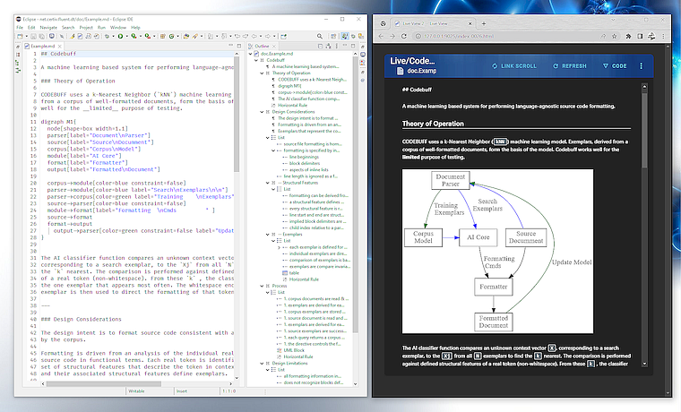
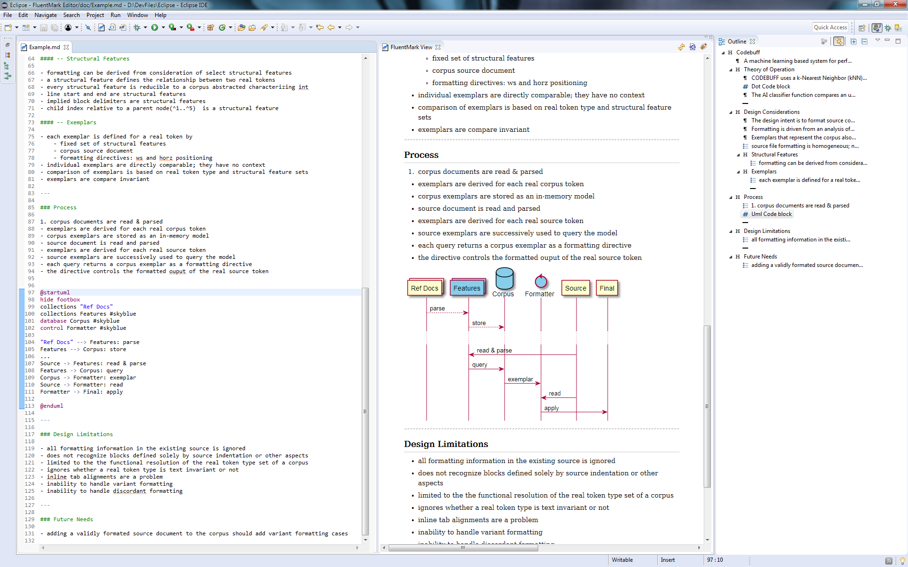

# FluentMark Advantest Edition (AE)

A full-featured Markdown editing environment for Eclipse IDE.
FluentMark was originally developed by [Certiv Analytics](https://www.certiv.net/index.html) / [Gerald Rosenberg](https://github.com/grosenberg) and
was modified for [Advantest Europe GmbH](https://www.advantest.com/) to better satisfy company-specific needs.

This work is forked from [https://github.com/grosenberg/Fluentmark](https://github.com/grosenberg/Fluentmark).

## Features 

+ Choice of Markdown converter
    - support for the [flexmark](https://github.com/advantest/flexmark-java) converter (preferred)
    - support for the [Pandoc](https://pandoc.org) converter
+ Real-time preview
    - smooth, reactively rendered HTML display, using [Vue.js](https://vuejs.org/)
    - stylesheet controlled presentation
        + multiple built-in stylesheets
        + local custom/user defined stylesheets
+ PDF export using Pandoc
    - custom/user defined LaTeX page template support
+ LaTex/Math presentation using [MathJax](https://www.mathjax.org/)
+ Code highlighting using [highlight.js](https://highlightjs.org/)
+ Diagram rendering
    - UML diagrams using the [PlantUML](https://plantuml.com/) language
    - Graph diagrams using the [Graphviz DOT](http://www.graphviz.org/) language
    - all diagram previews are rendered in real-time
    - exported Web and PDF documents embed the diagrams as scalable SVG images
+ Spell check with quick-assist correction processor
+ Smart editing behaviors, including intelligent paragraph, list & blank line handling
+ Table editor
+ Text, list and table formatter
+ Outline view with drag-and-drop support

## Screenshots

<figure>
  
  <figcaption>1. Dot Graph</figcaption>
</figure>

<figure>
  
  <figcaption>2. Sequence Diagram</figcaption>
</figure>

## Installation & Use

Requires Eclipse 2023-12 or newer & JDK 21+.

Build from sources and install from local update site in `net.certiv.fluentmark.site/target/repository`
or install from Advantest's private update site for R&D department.

Preferences ---
- `Window`&rarr;`FluentMark`

Pandoc converter ---
- Install [Pandoc](https://pandoc.org). The `pandoc` executable can then be selected from the local filesystem 
  on the Pandoc Converter preference page.

PDF export ---
- Both *Pandoc* and a _LaTeX_ processor must be installed. Pandoc recommends [*MikTeX*](https://miktex.org/).

DOT graphics ---
- Install [Graphviz](http://www.graphviz.org/download.php). The `dot` executable can then be selected 
  on the Converter preference page.

UML diagrams ---
- The basic PlantUml jar is built-in. Diagrams other than sequence diagrams require DOT graphics. If 
  `Graphviz` is installed in a non-default directory, set the `GRAPHVIZ_DOT` environment variable to 
  the actual installation directory.

### Keys

|Key             |Function                                          |
|:---------------|:-------------------------------------------------|
|Ctrl-Space      |Opens the template assist popup                   |
|Ctrl-1          |Spell check quick correct                         |
|Ctrl-b          |Toggles **bold** of selected text                 |
|Ctrl-i          |Toggles _italics_ of selected text                |
|Ctrl-/          |Toggles Markdown-style commenting of selected text|
|Ctrl-Shift-/    |Toggles HTML-style commenting of selected text    |
|Ctrl-Shift-f    |Format - full page or selection                   |
|Ctrl-Shift-Alt-f|Format - with unwrapped text                      |

### Math

In-line Math uses single `$` open/close delimiters. Can be embedded in other markdown features.

The opening `$` _must_ have a non-space character immediately right.  The closing `$` _must_ have a non-space 
character immediately left and _must_ be followed immediately by a non-digit. 

Math blocks are delimited using double `$` (*i.e.*, `$$`) marks at the left margin. The open delimiter 
must follow a blank line and the close delimiter must lead a blank line.

### Table Editor

`Double-click` on a table to open the table editor. While in the editor, `double-click` a cell to edit 
text. `Tab` and arrow keys will navigate between cells. `Return` to end cell editing.

## Support

Open an [issue on Github](https://github.com/advantest/fluentmark/issues). 

Provide as much information as applicable, including the plugin version number, any error message encountered, 
and a minimal example of the Markdown text at issue.

### Resources

1. Markdown Syntax
    - [Pandoc's Markdown](https://pandoc.org/MANUAL.html#pandocs-markdown)
    - [GitHub Flavored Markdown](https://github.github.com/gfm/)
    - [Daring Fireball Markdown](https://daringfireball.net/projects/markdown/syntax)
1. [TEX Commands available in MathJax](http://www.onemathematicalcat.org/MathJaxDocumentation/TeXSyntax.htm)
1. [PlantUML Language Specification](https://plantuml.com/en/guide)
1. [Dot Language Man Page](http://www.graphviz.org/pdf/dot.1.pdf)
1. Pandoc Latex Templates (for PDF generation):
    - [Starter Templates](https://github.com/jez/pandoc-starter)
    - [Letter Template](https://github.com/aaronwolen/pandoc-letter)
    - [Notes Oriented Template](https://github.com/Wandmalfarbe/pandoc-latex-template)
    - [Collection of Templates](https://github.com/lauritzsh/pandoc-markdown-template)

## License

[EPL v1](license.md)

